<div align="center">

# 🏨 Hostel Leave Management System

### A Flask-Based Web Application for Digital Hostel Leave Management

[](https://www.python.org/)
[](https://flask.palletsprojects.com/)
[](https://www.postgresql.org/)
[](https://www.sqlite.org/)
[](https://getbootstrap.com/)
[](https://render.com/)
[](https://github.com/)

<br>

[](https://hostel-leave-management-system-w0nu.onrender.com)

*A complete digital solution for managing hostel leave requests efficiently.*

</div>

---

## 📖 Project Overview

The **Hostel Leave Management System** is a web-based application developed to digitize and simplify the hostel leave approval process.

Instead of maintaining paper-based leave records, students can register, log in and submit leave requests online. Wardens can access a separate dashboard to review, approve or reject those requests.

The application provides student and warden modules, session-based authentication, leave-status tracking, notifications, profile management and downloadable PDF leave reports.

The deployed application uses **PostgreSQL** for persistent data storage, while the local version automatically uses **SQLite**.

---

## 🎯 Project Objectives

- Replace the traditional paper-based hostel leave process.
- Allow students to submit and track leave requests online.
- Provide wardens with a centralized leave-management dashboard.
- Notify students when requests are approved or rejected.
- Store deployed application data persistently using PostgreSQL.
- Provide a responsive and user-friendly interface.

---

## ✨ Features

### 👨‍🎓 Student Module

- Student registration
- Secure student login
- Personalized dashboard
- Apply for hostel leave
- View leave history
- Track pending, approved and rejected requests
- View notifications
- View profile information
- Change account password
- Download PDF leave report
- Secure logout

### 👮 Warden Module

- Separate warden login
- Warden dashboard
- View all student leave applications
- View student names and email addresses
- Approve leave requests
- Reject leave requests
- Automatically generate student notifications
- Manage leave records
- Secure warden logout

---

## 🛠️ Technology Stack

### Frontend

- HTML5
- CSS3
- Bootstrap 5.3
- JavaScript
- Font Awesome
- Google Fonts

### Backend

- Python
- Flask
- Gunicorn

### Database

- PostgreSQL for the deployed application
- SQLite for local development

### Python Libraries

- Flask
- psycopg2-binary
- ReportLab
- Pillow
- QRCode
- python-dotenv

### Development and Deployment

- Visual Studio Code
- Git
- GitHub
- Render

---

## 📊 Project Information

| Category | Details |
|---|---|
| Project Name | Hostel Leave Management System |
| Application Type | Web Application |
| Backend Framework | Flask |
| Programming Language | Python |
| Frontend | HTML, CSS, Bootstrap and JavaScript |
| Online Database | PostgreSQL |
| Local Database | SQLite |
| Authentication | Session-based authentication |
| PDF Generation | ReportLab |
| Production Server | Gunicorn |
| Deployment Platform | Render |
| Version Control | Git and GitHub |

---

## 📂 Project Structure

```text
Hostel-Leave-Management-System/
│
├── app.py
├── hostel.db
├── requirements.txt
├── render.yaml
├── README.md
│
├── screenshots/
│   ├── home.png
│   ├── student_login.png
│   ├── student_register.png
│   ├── student_dashboard.png
│   ├── apply_leave.png
│   ├── notifications.png
│   ├── profile.png
│   ├── change_password.png
│   ├── warden_login.png
│   ├── warden_dashboard.png
│   └── approved_leave.png
│
├── static/
│   ├── css/
│   ├── images/
│   └── qr_codes/
│
├── templates/
│   ├── student/
│   ├── admin/
│   └── home.html
│
└── reports/
```

---

## 🌐 Live Application

The deployed version of the project is available at:

**https://hostel-leave-management-system-w0nu.onrender.com**

> The Render free service may take a few moments to start after a period of inactivity.

---

## 🚀 Local Installation

### 1. Clone the Repository

```bash
git clone https://github.com/Vivan178/Hostel-Leave-Management-System.git
```

### 2. Open the Project Directory

```bash
cd Hostel-Leave-Management-System
```

### 3. Create a Virtual Environment

#### Windows

```powershell
python -m venv venv
venv\Scripts\activate
```

#### Linux or macOS

```bash
python3 -m venv venv
source venv/bin/activate
```

### 4. Install Dependencies

```bash
pip install -r requirements.txt
```

### 5. Run the Application

```bash
python app.py
```

### 6. Open the Local Website

```text
http://127.0.0.1:5000
```

When no `DATABASE_URL` environment variable is provided, the application automatically uses the local SQLite database.

---

## ☁️ Render Deployment Configuration

The application is deployed using the following Render configuration:

```yaml
services:
  - type: web
    name: hostel-leave-management-system
    runtime: python
    buildCommand: pip install -r requirements.txt
    startCommand: gunicorn app:app
```

The deployed service uses the following environment variables:

```text
DATABASE_URL
SECRET_KEY
```

`DATABASE_URL` connects the web application to PostgreSQL, while `SECRET_KEY` secures Flask sessions.

> Database connection credentials must never be committed to GitHub.

---

## 📸 Application Screenshots

### 🏠 Home Page

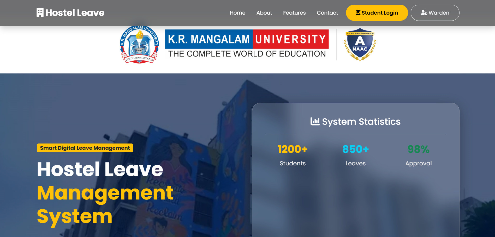

---

### 👤 Student Login

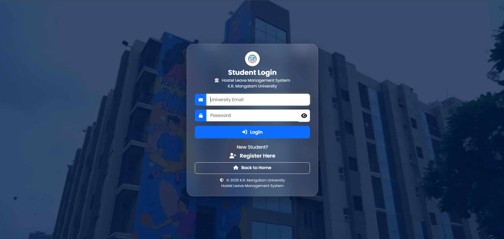

---

### 📝 Student Registration

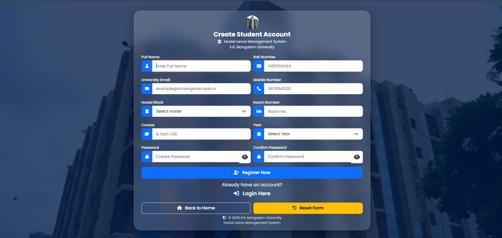

---

### 📊 Student Dashboard

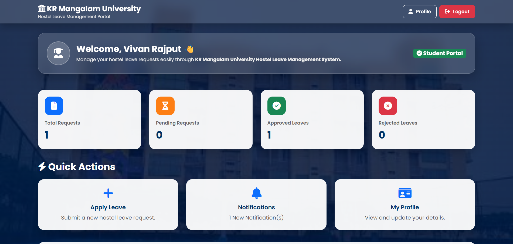

---

### 🗓️ Apply for Leave

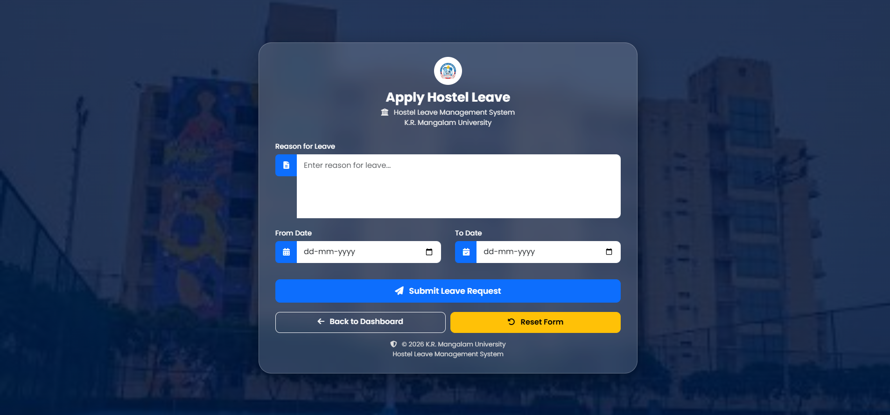

---

### 🔔 Student Notifications

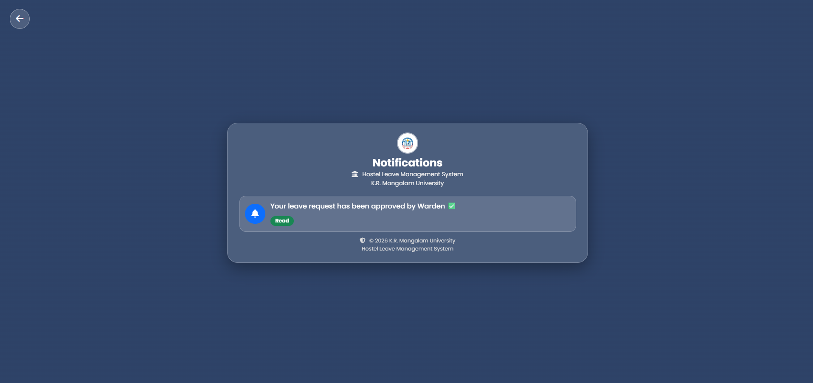

---

### 👤 Student Profile

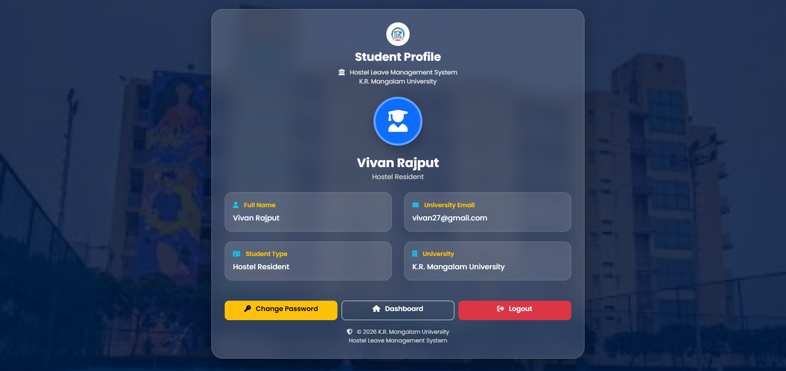

---

### 🔑 Change Password

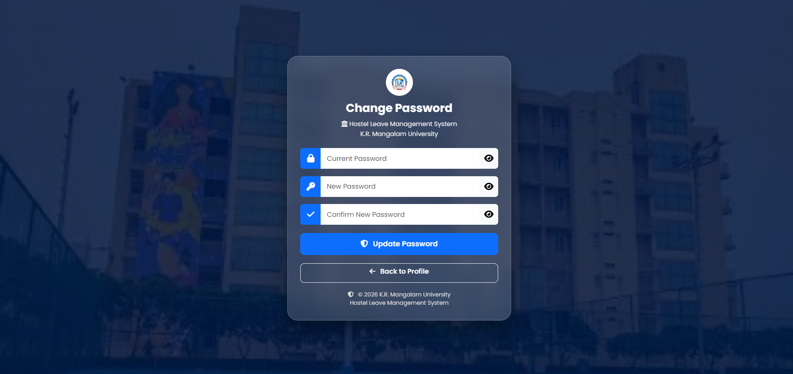

---

### 👮 Warden Login

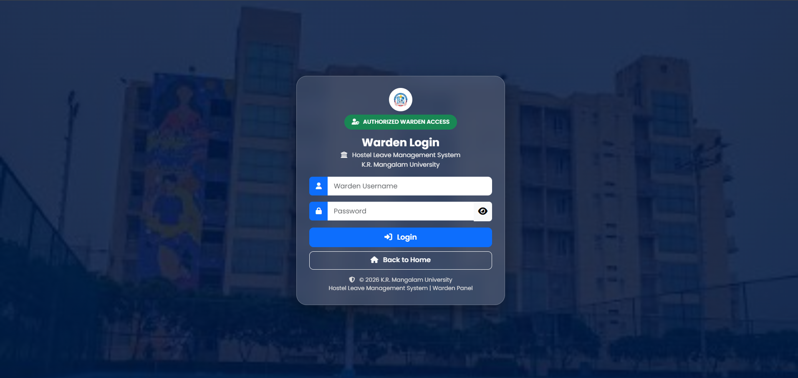

---

### 📋 Warden Dashboard

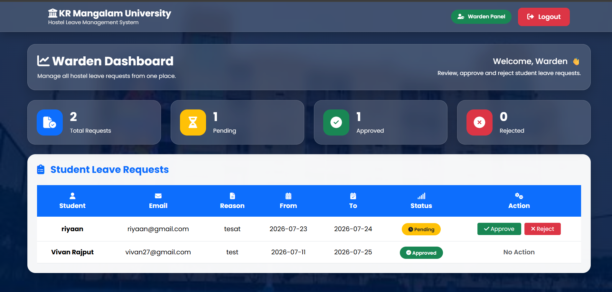

---

### ✅ Approved Leave Request

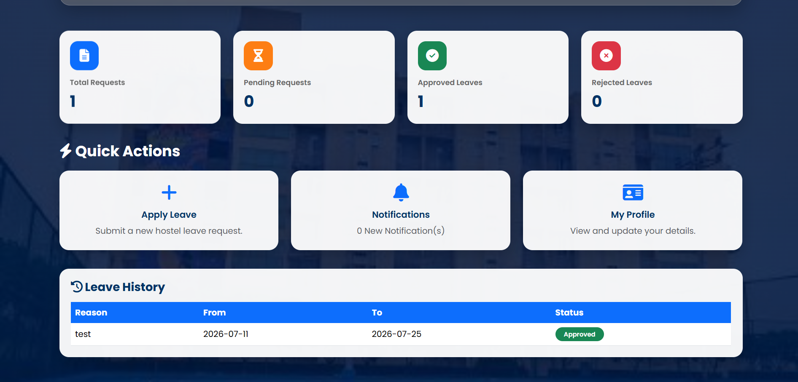

---

## 🔄 Application Workflow

```text
Student Registration
        ↓
Student Login
        ↓
Submit Leave Request
        ↓
Request Stored in Database
        ↓
Warden Reviews Request
        ↓
Approve or Reject
        ↓
Student Receives Notification
        ↓
Updated Status Appears on Dashboard
```

---

## 🗄️ Database Tables

### Students

Stores student account information.

| Field | Description |
|---|---|
| id | Unique student ID |
| name | Student name |
| email | Unique student email |
| password | Student account password |

### Leaves

Stores student leave applications.

| Field | Description |
|---|---|
| id | Unique leave request ID |
| student_id | ID of the student |
| reason | Reason for leave |
| from_date | Leave starting date |
| to_date | Leave ending date |
| status | Pending, Approved or Rejected |

### Admins

Stores warden login information.

| Field | Description |
|---|---|
| id | Unique admin ID |
| username | Warden username |
| password | Warden password |

### Notifications

Stores notifications generated after leave decisions.

| Field | Description |
|---|---|
| id | Unique notification ID |
| student_id | ID of the student |
| message | Notification message |
| status | Read or Unread |

---

## 🔐 Access and Session Features

- Separate student and warden login pages
- Session-based login management
- Protected student dashboard
- Protected warden dashboard
- Unique student email validation
- Separate logout routes
- Environment-based secret key
- PostgreSQL credentials stored through environment variables

> For a future production version, passwords should be stored using secure password hashing.

---

## 🧪 Testing

The application has been tested for the following operations:

| Test Case | Result |
|---|---|
| Home page loading | Passed |
| Student registration | Passed |
| Duplicate email handling | Passed |
| Student login | Passed |
| Invalid student login handling | Passed |
| Leave application submission | Passed |
| Student dashboard statistics | Passed |
| Warden login | Passed |
| Leave request display | Passed |
| Leave approval | Passed |
| Leave rejection | Passed |
| Student notification generation | Passed |
| Password update | Passed |
| PDF report generation | Passed |
| PostgreSQL data persistence | Passed |
| Responsive interface | Passed |
| Render deployment | Passed |

---

## 🚀 Future Enhancements

- Secure password hashing
- Email notifications
- SMS notifications
- Parent approval module
- Multiple hostel support
- Role-based administration
- Warden analytics dashboard
- Search and filtering options
- Leave cancellation feature
- Cloud-based document storage
- Mobile application
- Automated testing
- Audit logs
- Two-factor authentication

---

## 👨‍💻 Developer

**Vivan Kumar**

🎓 Bachelor of Computer Applications  
**Specialization:** Artificial Intelligence & Data Science

🏫 K.R. Mangalam University

💻 Python • Flask • PostgreSQL • SQLite • HTML • CSS • Bootstrap

---

## 🙏 Acknowledgements

Special thanks to:

- K.R. Mangalam University
- Flask community
- Bootstrap team
- PostgreSQL community
- SQLite community
- Render
- GitHub

---

## 📄 Academic Use

This project was developed as an academic project for the **Bachelor of Computer Applications in Artificial Intelligence & Data Science** program at **K.R. Mangalam University**.

© 2026 Vivan Kumar. All Rights Reserved.

---

<div align="center">

### ⭐ If you find this project useful, consider giving the repository a star!

Made with ❤️ using Python and Flask.

</div>